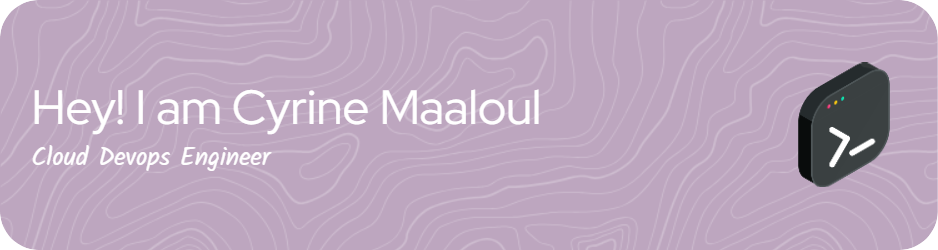

### Hi there, I am Cyrine Maaloul 👋

👨‍🎓 Passionate explorer in technology, driven by crafting seamless user experiences and driving innovation.  
🔭 Constantly inspired Cloud DevOps Engineer, seeking growth and new challenges. 
👨‍🏫 Committed to continuous learning and collaboration, aiming to exceed user expectations. 
💬 Join me in creating impactful experiences and fostering growth in tech. 
💪 This is where I write, code and solve problems:  

## 🌐 Socials:
   

# 💻 Tech Stack:
👨‍💻 Programming languages
      

🧰 Frameworks and libraries
   

💻 DevOps tools
           

# 📊 GitHub Stats:
 
 

---

<!-- Proudly created with GPRM ( https://gprm.itsvg.in ) -->
